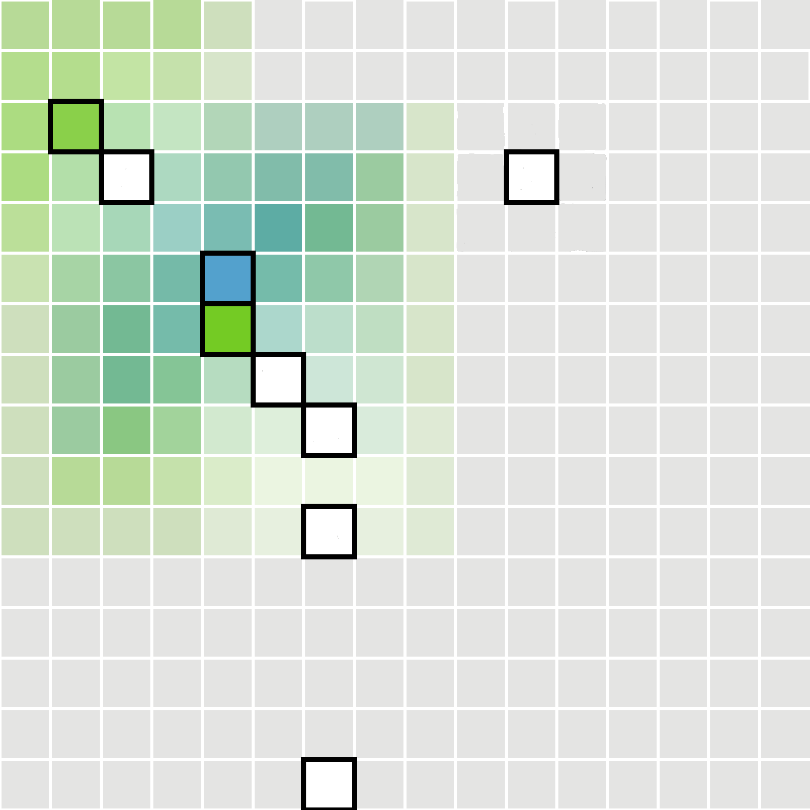
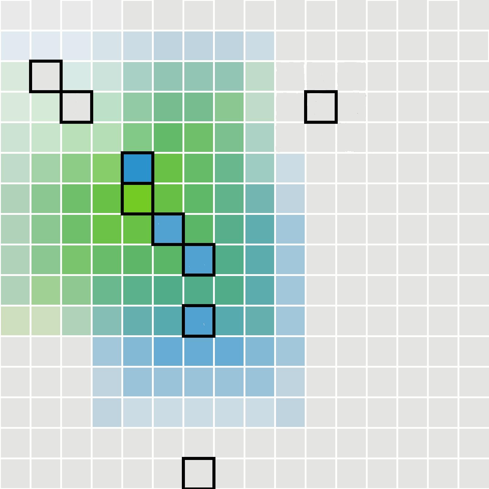

## Introduction to the Project

## Running the Code

```{r}
#load the required libraries
library(readxl)
library(dplyr)
library(ggplot2)
library(tidyverse)
library(corrplot)
library(chisq.posthoc.test)
library(ggcorrplot)
#getting the data from the adjusted database
data <- read_excel("data/cienega_sites.xlsx", guess_max = 10000)
```

```{r}
dfSites <- data.frame(NACRE=data$NACRE,NO_NACRE=data$"NON-NACRE")
dfSites <- na.omit(dfSites)
dfSites <- dfSites[-c(1,2,3,4,6,7,8,12,13),] #getting rid of the san pedro sites
summary(dfSites)
#running the test
chisqSites <- chisq.test(dfSites, correct = F)
chisqSites
#observed chi-square is 1355.6 w/ 17 degrees of freedom and a p-value <2.2e-16.
#this allows us to reject our null hypothesis
```

```{r}
chisqSites$observed
round(chisqSites$expected,2)
round(chisqSites$residuals, 2)
chisq.posthoc.test(dfSites, method = "bonferroni")
#statistically revelant sites
##Clearwater (0.0000000)
##Coffee Camp (0.0000000)
##Los Pozos (0.0000000)
##Santa Cruz Bend (0.0000000)
##Stone Pipe (0.003663)
##Wetlands (0.0000000)
```

```{r}
#visualizing residuals
corrplot(chisqSites$residuals,is.cor = FALSE)
#which forms favor which shell type
##Clearwater favors NO_NACRE (-4.32/4.95)
##Coffee Camp favors NACRE (17.02/-19.51)
##Los Pozos favors NO_NACRE (-14.10/16.16
##Santa Cruz Bend favors NO_NACRE (-14.10/16.16)
##Stone Pipe favors NO_NACRE (-2.54/2.91)
##Wetlands favors NACRE (4.87/-5.58)
```

## The Map




